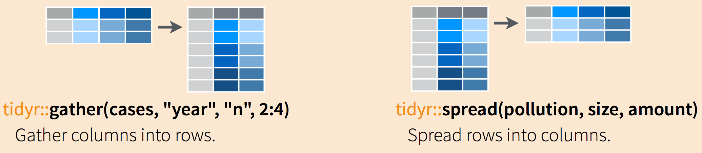

```{r setup, include=FALSE}
knitr::opts_chunk$set(echo = TRUE)
suppressPackageStartupMessages({
  library(dplyr)
  library(tidyr)
  library(ggplot2)
})
```

## Overview

> Data scientists, according to interviews and expert estimates, spend from 50 percent to 80 percent of their time mired in the mundane labor of collecting and preparing data, before it can be explored for useful information.  

This tutorial covers the *very basics* of `tidyr` package. Usage:  

* General data handling \& processing
* `ggplot2` plots (long format required)
* Eurostat: data in long format, wide format often required for regression analysis
* Panel data analysis

--- 

## Wide format
* For **cross sections**, row corresponds to an individual (person, firm, etc.) and each column corresponds to a variable (age, height, weight). 

* For **time series**, row corresponds to a time period (year, quarter, day, etc.) and each column corresponds to a variable (GDP per capita, Unemployment rate). 

* Wide format is used in many `R`-based applications: linear regression, VAR models, etc.


## Long format
* For **cross sections**, data is stretched so that a single individual may occupy multiple rows.
* The same applies to **time series**

---

## TS Example - wide format

```{r}
GDPwide <- data.frame(
  Year = c(2009:2018),
  GER = c(411,723,325,456,579,612,709,513,527,379),
  FRA = c(123,300,400,500,600,654,789,906,413,567),
  USA = c(957,1000,569,896,956,1345,780,599,1023,678)
)
GDPwide # artifical/made-up data used here
```
--- 

## `gather()` and `spread()` commands

+ `gather()` converts wide format to long
+ `spread()` converts long format to wide



---

### Convert `GDPwide` to long format

`gather(GDPwide, key = "State", value = "GDP", 2:4)`

* `GDPwide` dataframe to reshape - convert to long format
* `"State"` is the name of the new key column (any character string you supply)
* `"GDP"` name of the new value column (any character string you supply)
* `2:4` names or numeric indexes of columns to collapse. Please note that column `Year` (1st column) is left out (Year is the grey column as in the illustration).

```{r}
GDPlong <- gather(GDPwide, key = "State", value = "GDP", 2:4)
print(GDPlong)
```

Please note that `GDPlong` is suitable for panel data analysis - both `id` and `time` identification is provided in each row.


---

### Convert `GDPlong` to wide format 

`spread(GDPlong, key = "State", value = "GDP")`

* `GDPlong` dataframe to reshape 
* `key = "State"` column to use for keys (new columns names)
* `value = "GDP"` column to use for values (new column cells)
* Please note that column `Year` is left out from the syntax (Year is the grey column as in the illustration).

```{r}
GDPwide_2 <- spread(GDPlong, key = "State", value = "GDP")
GDPwide_2
GDPwide # for comparison
```

Note that `GDPwide_2` columns are alphabetically organized now.

---

Alternatively, we may choose a *"transposed"* wide format:

```{r}
spread(GDPlong, key = "Year", value = "GDP")
```

* However, this formatting is not very useful for most econometric applications.

--- 

#### Data in long format are used in panel data regression, plotting by `{ggplot2}`, etc.

```{r}
Plot1 <- ggplot(data = GDPlong, aes(x = Year, y = GDP))+
  geom_line(aes(color=State))+
  xlab("Year")+ylab("Artificial GDP data")+
  facet_grid(State~.)
Plot1

Plot2 <- ggplot(data = GDPlong, aes(x = Year, y = GDP))+
  geom_line(aes(color=State))+
  theme(panel.grid.major = element_blank(), panel.grid.minor = element_blank())+  
  xlab("Year")+ylab("Artificial GDP data")+
  theme_light()
Plot2
```

---

> Advanced data reshaping tools

`{tidyr}` provides sufficient functionality for many empirical tasks.

If necessary, additional control over reshaping data may be obtained throught the `{reshape2}` package:

* `melt()` from `{reshape2}` expands the functionality of `gather()`
* `cast()` from `{reshape2}` expands the functionality of `spread()` 


For additional information on `{reshape2}`, see:

+ [Tutorial by Timothy Carsel](https://ademos.people.uic.edu/Chapter8.html) 
+ [Tutorial by Sean C. Anderson](https://seananderson.ca/2013/10/19/reshape/) 
+ [reshape2 pdf](https://cran.r-project.org/web/packages/reshape2/reshape2.pdf) 

---

## `{tidyr}` Excercise

The following wide-format dataset contains actual GDP per capita in Spain (from Eurostat)

* Euro per inhabitant in percentage of the EU average (100 = EU's average in a given year)
* 2005 - 2016 data
* Measured at the [NUTS2 level](https://en.wikipedia.org/wiki/NUTS_statistical_regions_of_Spain)


```{r}
GDPSpain <- read.csv("datasets/GDPSpain.csv")
head(GDPSpain[,1:8],12) # only columns 1 to 8 are shown
str(GDPSpain)
dim(GDPSpain)
``` 

Using the `gather()` command, convert `GDPSpain` to a long format


```{r}
# uncomment the following line and comlete the command
# GDPSpain_L <- gather()
```


Use the `spread()` command to transform `GDPSpain_L` (long format) back to the original wide format

```{r}
# uncomment the following line and comlete the command
# GDPSpain_W2 <- spread()
```


As a bonus task, you may use `ggplot2` to plot the data (selected regions).

---- 


